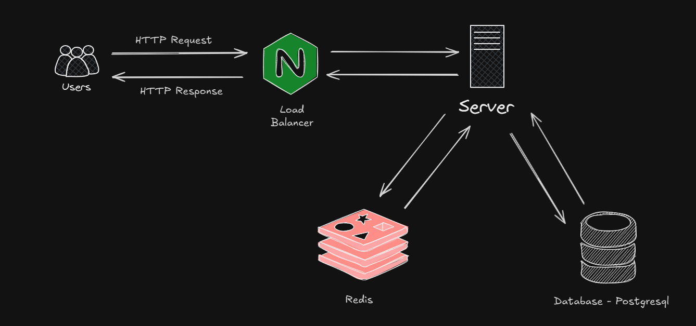

# 📌 System Design: Social Media Application

---

---

## 1. Clarify Requirements

### Functional Requirements
- User authentication (register, login, logout)
- Follow / unfollow other users
- Post creation (text + multiple images)
- Like / unlike posts
- Comment on posts
- Get list of posts from followed users (feed)
- Get post details (likes count, comments)
- Notifications for unread likes, comments, follows

### Non-Functional Requirements
- Fast response time (API < 200ms)
- Data consistency for likes/comments/posts
- Caching frequently accessed data (user profile, feed)
- Secure handling of passwords and tokens

---

## 2. High-Level Design

### Key Components
- **PostgreSQL**: transactional data (users, posts, likes, comments, followers)
- **Redis**: caching user profiles and feed
- **Backend (Go + Gin)**: REST API
- **File Storage**: local disk for post/profile images

---

## 3. Low-Level Design

### API Design

#### Authentication Endpoints

| Method | Endpoint | Description | Auth Required |
|--------|----------|-------------|---------------|
| POST   | `/auth`          | User login        | ❌ |
| POST   | `/auth/register` | User registration | ❌ |
| DELETE | `/auth`          | User logout       | ✅ |

#### User Endpoints

| Method | Endpoint | Description | Auth Required |
|--------|----------|-------------|---------------|
| GET    | `/user`           | Get user profile | ✅ |
| PATCH  | `/user`           | Update profile   | ✅ |
| POST   | `/user/:id`       | Follow           | ✅ |
| DELETE | `/user/:id`       | Unfollow         | ✅ |
| GET    | `/user/follower`  | Get followers    | ✅ |
| GET    | `/user/following` | Get following    | ✅ |

#### Post Endpoints

| Method | Endpoint | Description | Auth Required |
|--------|----------|-------------|---------------|
| GET    | `/post`             | Get following posts        | ✅ |
| GET    | `/post/:id`         | Get post details           | ✅ |
| POST   | `/post`             | Create post                | ✅ |
| POST   | `/post/:id/like`    | Like post                  | ✅ |
| DELETE | `/post/:id/like`    | Unlike post                | ✅ |
| POST   | `/post/comment`     | Create comment             | ✅ |
| GET    | `/post/:id/comment` | Get all comments by post   | ✅ |

#### Notification Endpoints

| Method | Endpoint | Description | Auth Required |
|--------|----------|-------------|---------------|
| GET    | `/notif` | Get unread notifications | ✅ |

---

### Database Design

**Tables:**
- `accounts` (id, email, password, created_at, updated_at)
- `profiles` (id, fullname, phone, img, created_at, updated_at)
- `followers` (account_id, follower_id, read, created_at, deleted_at)
- `posts` (id, account_id, caption, created_at, updated_at, deleted_at)
- `post_imgs` (id, post_id, img, created_at, deleted_at)
- `likes` (id, account_id, post_id, read, created_at, deleted_at)
- `comments` (id, account_id, post_id, comment, read, created_at, updated_at, deleted_at)

---

## 4. Address Key Issues (Simplified)

### Scalability
- Use Redis for caching feed and profiles

### Reliability
- Use transactions for likes, comments, and follows
- Soft delete for data recovery

### Availability
- Redis for fast access and to reduce DB load
- Store image files in persistent volumes
